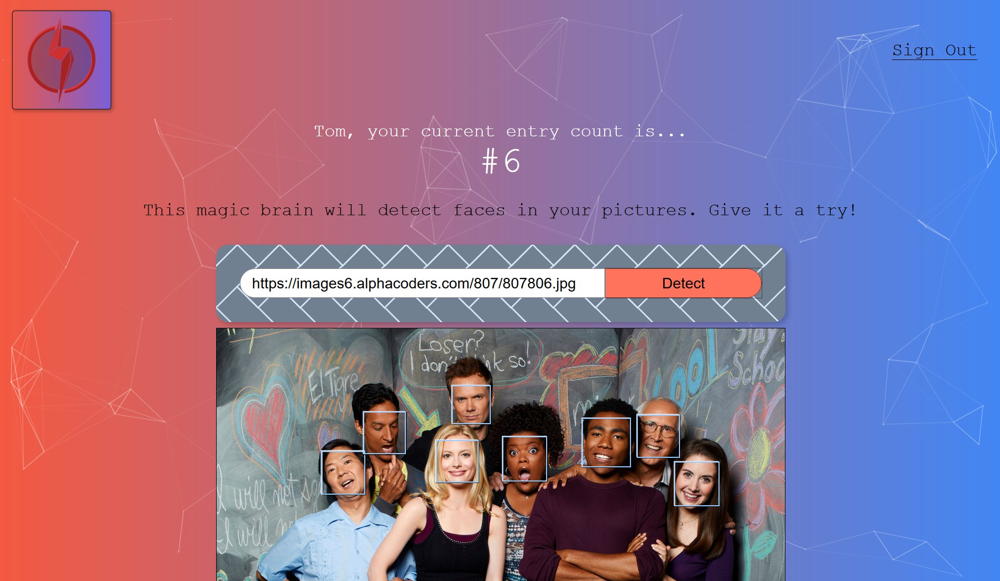

A React.js project using the Clarifai API for facial recognition.

Features:
- account registration
- sign in/out
- input image link to activate face recognition

Technology used:
- HTML, CSS, JS, JSX, React, Tachyons CSS
- Node JS, Express, Knex, Bcrypt
- PostgreSQL
- Git, Heroku, Github

Using the Clarifai API

Register

Sign In

